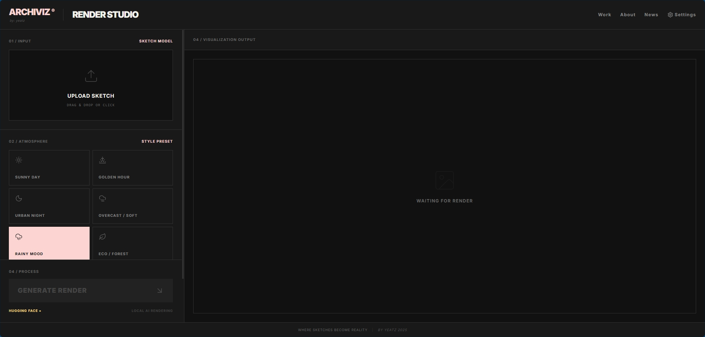
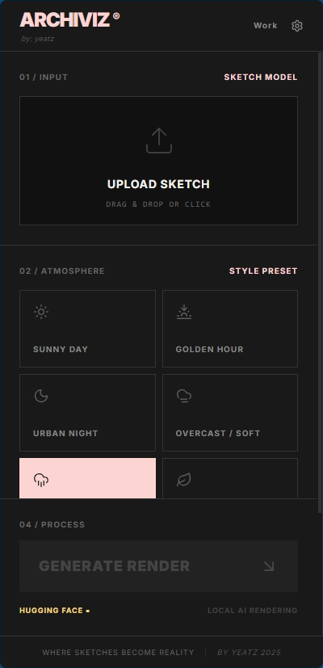

# ARCHIVIZ® Render Studio

**Where Sketches Become Reality**

An AI-powered architectural visualization tool that transforms sketches and 3D models into photorealistic renders. Built with React, TypeScript, and Tailwind CSS.




## Features

- **AI-Powered Rendering** - Transform architectural sketches into photorealistic visualizations
- **Multiple AI Providers** - Supports Hugging Face, Ollama, and LM Studio
- **Environment Presets** - Choose from various lighting and atmosphere settings
- **Advanced Controls** - Adjust creativity strength, negative prompts, and seeds
- **Comparison View** - Side-by-side comparison of original sketch and rendered output
- **Progressive Web App** - Install on any device, works offline
- **Brutalist Design** - Clean, modern UI with dark theme

## Quick Start

### Prerequisites

- Node.js 18+
- npm or yarn
- Hugging Face API key (free tier available)

### Installation

1. Clone the repository:
```bash
git clone https://github.com/me-yeatz/Archiviz-ai-render.git
cd Archiviz-ai-render
```

2. Install dependencies:
```bash
npm install
```

3. Start development server:
```bash
npm run dev
```

4. Open http://localhost:3003 in your browser

### Setup AI Provider

1. Go to [huggingface.co/settings/tokens](https://huggingface.co/settings/tokens)
2. Create a new token with "Read" permission
3. Click **Settings** button in the app (top right)
4. Select **Hugging Face** as provider
5. Paste your API key
6. Click **Save Settings**

## Usage

1. **Upload** - Drag & drop or click to upload your architectural sketch
2. **Select Environment** - Choose lighting preset (Golden Hour, Overcast, Night, etc.)
3. **Adjust Settings** - Fine-tune creativity, add negative prompts
4. **Generate** - Click "Generate Render" and wait for AI magic
5. **Compare** - View before/after comparison or download result

## Environment Presets

| Preset | Description |
|--------|-------------|
| Golden Hour | Warm sunset lighting with long shadows |
| Overcast | Soft, diffused daylight |
| Night | Dramatic nighttime with artificial lighting |
| Eco Forest | Green environment with natural elements |
| Urban | City context with street-level view |
| Minimal | Clean white background, studio lighting |

## AI Provider Options

| Provider | Image Generation | Setup | Cost |
|----------|-----------------|-------|------|
| **Hugging Face** | Yes | Easy | Free* |
| **Ollama + SD** | Yes | Medium | Free |
| **LM Studio** | Analysis only | Easy | Free |

## Tech Stack

- **Frontend**: React 19 + TypeScript 5.8
- **Styling**: Tailwind CSS 4.1
- **Build Tool**: Vite 6.2
- **Icons**: Lucide React
- **AI**: Hugging Face Inference API / Ollama / LM Studio

## Project Structure

```
archiviz-ai-render/
├── App.tsx                 # Main application component
├── index.tsx               # React entry point
├── index.html              # HTML template with PWA meta tags
├── index.css               # Global styles
├── components/
│   ├── ImageUpload.tsx     # Image upload/dropzone
│   ├── EnvironmentSelector.tsx  # Environment presets
│   ├── AdvancedControls.tsx     # Render settings
│   ├── ResultViewer.tsx    # Output visualization
│   └── SettingsModal.tsx   # AI settings configuration
├── services/
│   └── localAIService.ts   # AI provider integration
├── public/
│   ├── Logo_Icon.png       # App logo
│   ├── manifest.json       # PWA manifest
│   └── sw.js               # Service worker
└── types.ts                # TypeScript interfaces
```

## PWA Installation

### Desktop (Chrome/Edge)
Click the install icon in the address bar

### iOS (Safari)
Tap Share → Add to Home Screen

### Android (Chrome)
Tap menu → Add to Home Screen

## Recommended Models

**Hugging Face:**
- `stabilityai/stable-diffusion-xl-base-1.0` (Best quality)
- `timbrooks/instruct-pix2pix` (Image-to-Image)
- `stabilityai/stable-diffusion-2-1` (Architecture)

## Roadmap

- [ ] Batch processing for multiple images
- [ ] Cloud storage integration
- [ ] Custom style training
- [ ] Higher resolution output
- [ ] Video rendering support

## Contributing

Contributions are welcome! Please feel free to submit a Pull Request.

1. Fork the repository
2. Create your feature branch (`git checkout -b feature/AmazingFeature`)
3. Commit your changes (`git commit -m 'Add some AmazingFeature'`)
4. Push to the branch (`git push origin feature/AmazingFeature`)
5. Open a Pull Request

## License

This project is licensed under the MIT License - see the [LICENSE](LICENSE) file for details.

## Author

**yeatz** - Senior Technical Architect & Self-Taught Developer

- GitHub: [@me-yeatz](https://github.com/me-yeatz)
- Email: mhyeatz@outlook.com
- LinkedIn: [linkedin.com/in/mnorhidayat](https://linkedin.com/in/mnorhidayat)

---



---

**Where Sketches Become Reality** | by yeatz 2025
